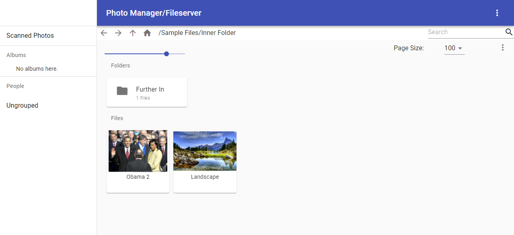
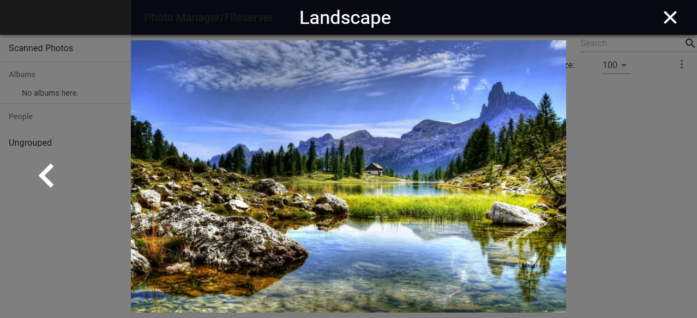
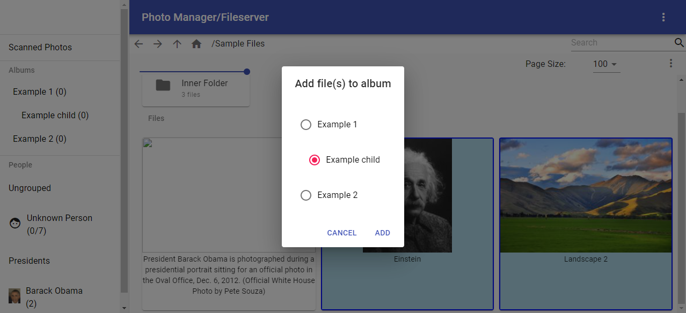
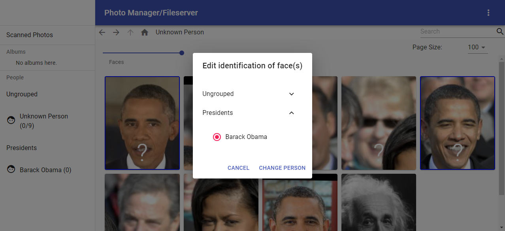
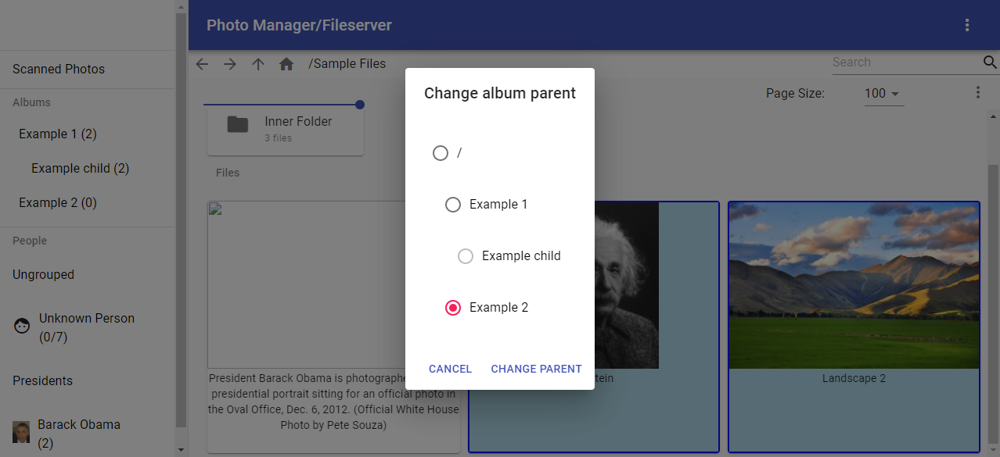

# Introduction

This project has three main goals:
- To provide a powerful photo management system (like, for example, Picasa)
- To allow for connection to a self-hosted file server
- To be open source

Example use case: I want to be able to remotely synchronise the photos on my phone and my computer, and organise them on either one. But, I don't want the cost/privacy issues of uploading to a third-party site.

# Demo

This site also contains a [live working demo](./demo/) of the project in its current state. I've added a small set of sample images to play around with. You will need to create an account to log in, and can use this account token: "e83b5c34fac030e88923f51bdb9f74561f11314afdceb72db830ad01a1448371".

# Screenshots

# More Information

See [the main repository](https://github.com/zsmith3/Photo-Manager-Client) for a list of existing and planned features, as well as installation/usage instructions.
